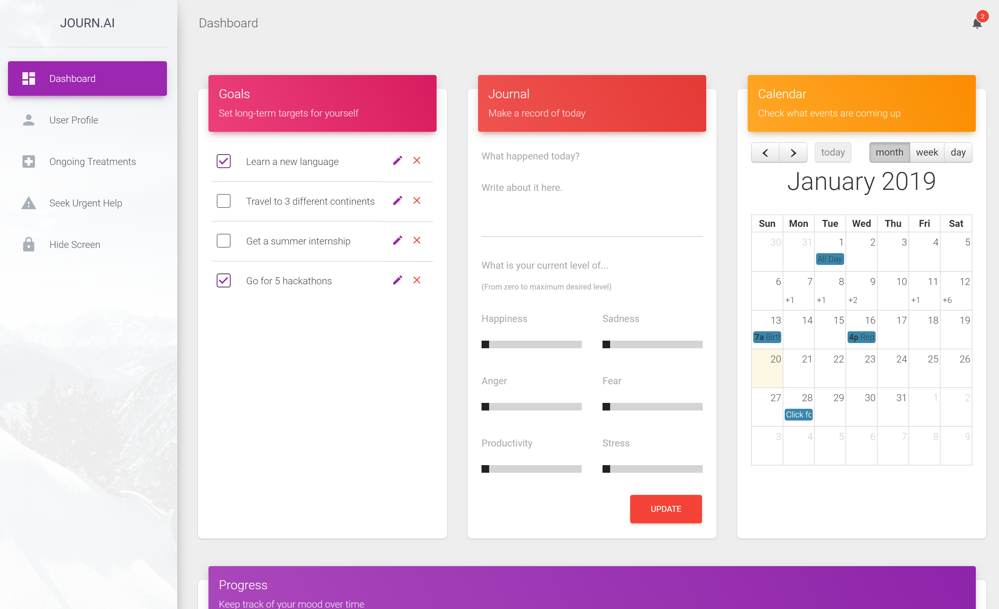
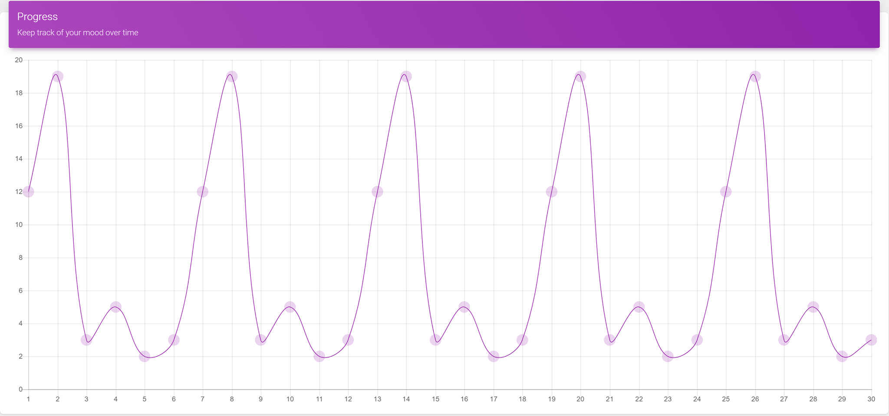
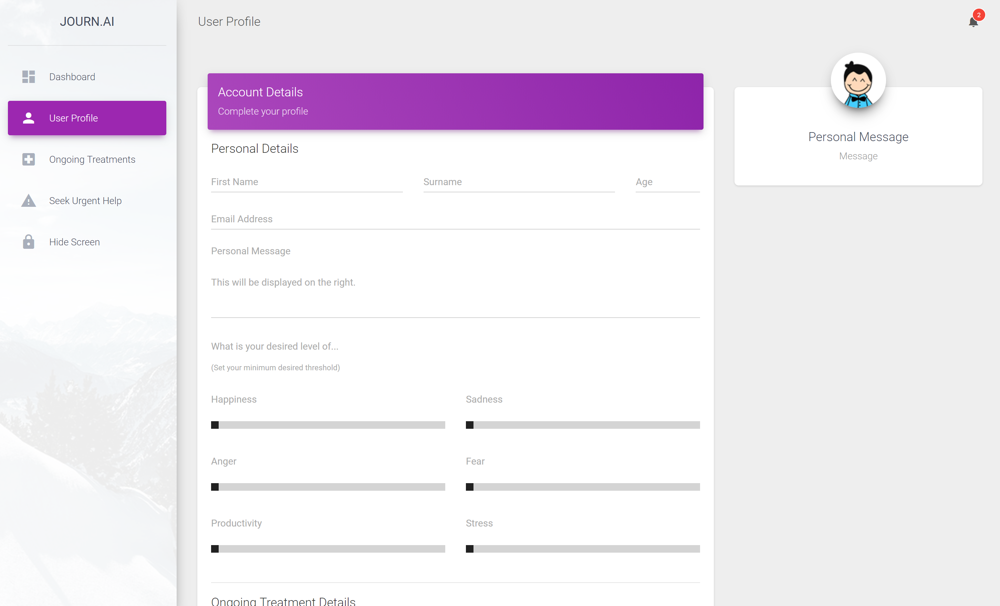
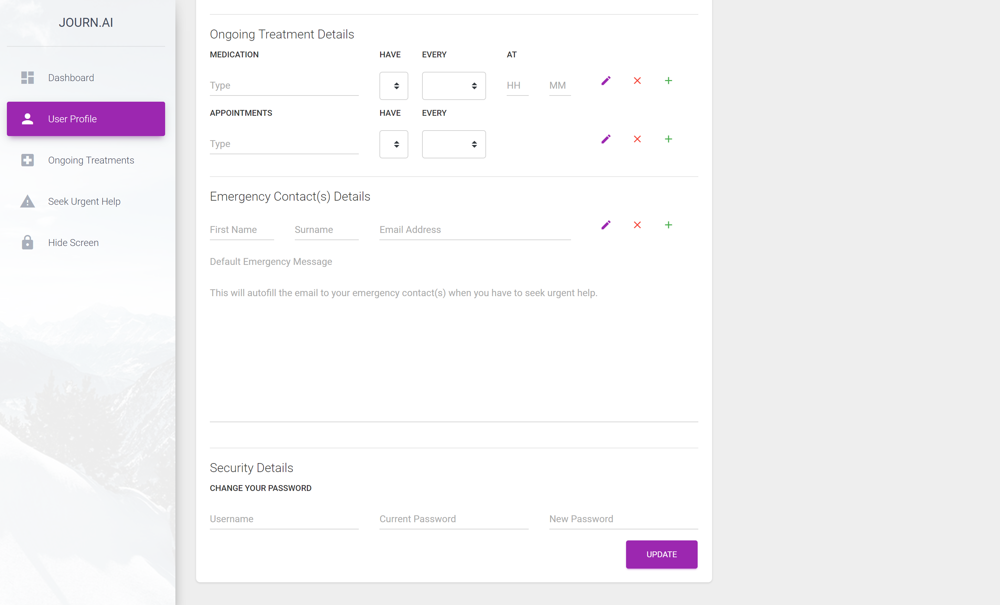
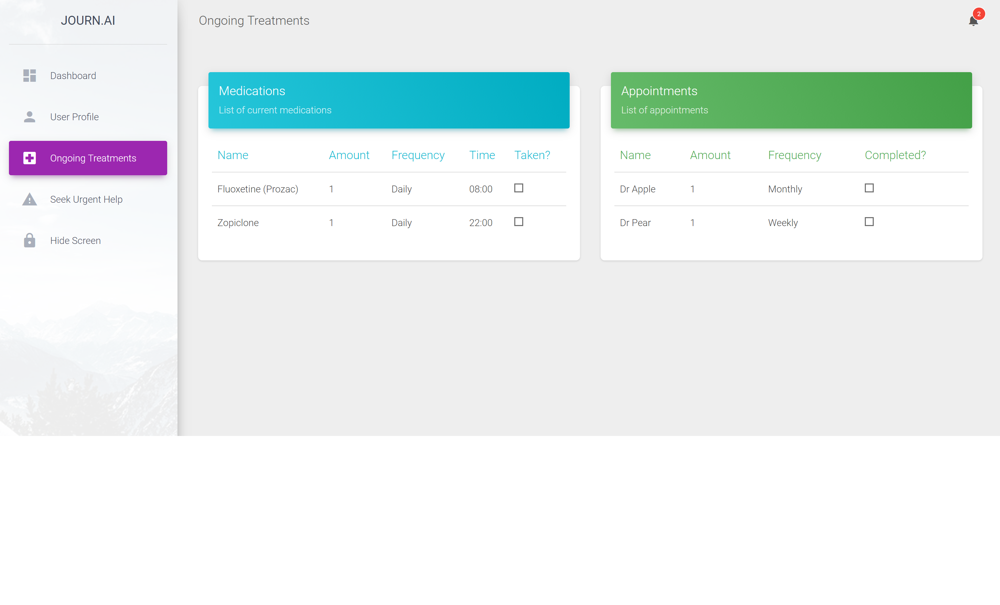
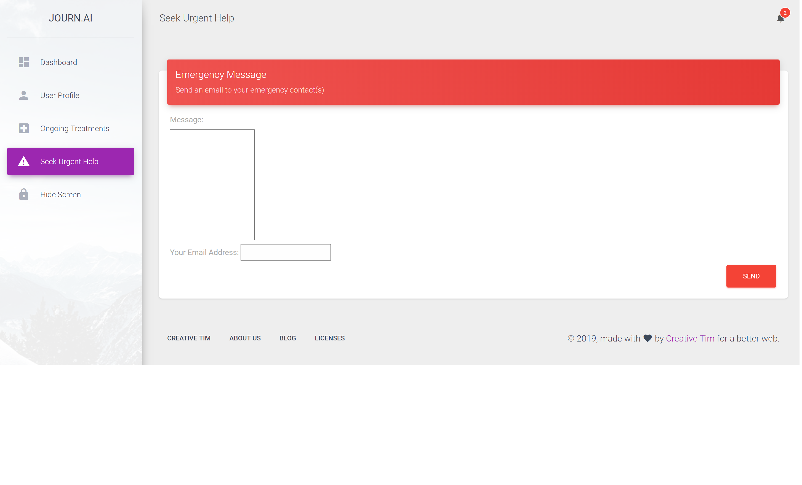
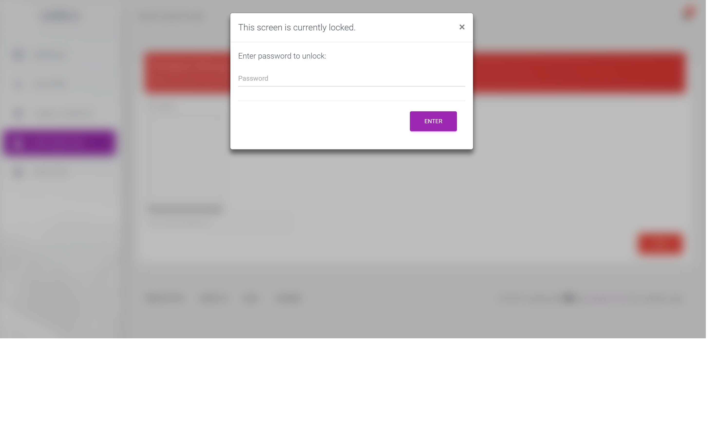
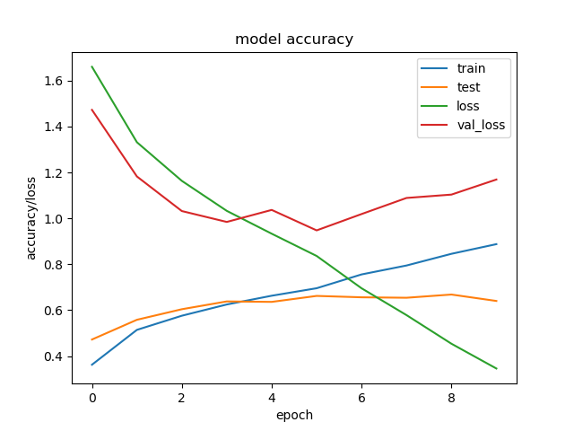
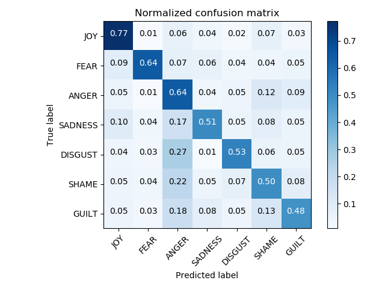

# JOURN.AI Space
## A data-driven approach to mental health

### Hack Cambridge 2019 Submission

Team members:
- Joonsu Gha
- Edward Stables
- Hu Fangfang
- Joe Arrowsmith

## User Experience

The frontend was built upon an MIT licensed bootstrap template, whereby a calendar, journal entry, mood chart, emergency email and hide current screen functionalities were implemented. The overall layout and design of these components were formulated with the user's privacy as one of the most important aspects, due to the sensitive nature of mental health. For instance, the initial dashboard is reminiscent of the usual productivity application with the mood chart accessible by scrolling down.  The hide screen feature was also incorporated for cases where the user feels the need to keep his dashboard hidden from those around him, until it is unlocked by the user himself with a password (we did not manage to implement the password unlocking feature). The email functionality was designed with the idea of having an auto filled message body which would have been set by the user beforehand for use in cases whereby the user wants to contact their emergency contact persons but may not feel well enough to be able to type out that they are unwell. The ongoing treatments page allows the user to have a quick checklist of their necessary medications or appointments, facilitating their healing process. In the user profile, the user can set a personal message to themselves which will be shown whenever they are on that page.

### Dashboard

### Journal Graph

### User Profile 

### Treatment

### Help

### Quick Lock

## Backend Framework:

The backend was programmed using the django framework. Django serves the user a preset page template depending on their url, as well as making database interactions quick and easy. The database was setup to contain the information viewed by the webapp user, as well as the information needed for the machine learning models. Due to some issues with getting data from the user, there wasn't time to fully integrate the UI with the database information, but a small amount more work to integrate these will give the webapp full functionality.

## Prediction Models:

A deep-learning based Natural Language Processing model was built for the automatic recognition of emotion from the journal entry of the user. The emotion variables, along with the user's calendar and health data, are used to calculate the Key Performance Index (KPI). Due to limited number of training examples, we used a pretrained work embedded that was trained on 550 million English tweets. Source: https://github.com/cbaziotis/ntua-slp-semeval2018

## Results

Results from twitter affective computing: 58.14% on test, current state-of-art is 57.7% +/- 6.3% with pretrained word embedding. Source: https://www.sciencedirect.com/science/article/pii/S0167923618301519#bb0435

### LSTM Training performance

### Affective Computing Results

## Moving Forward with Frontend

Future improvements to the user experience would be a fully functional mobile application (the current application is mobile browser friendly). It would include a functioning notifications feature for missed medications or appointments and possible reminders for the user to take good care of their mental health, especially when their mood chart indicates that they are feeling unwell overall. The mood chart can also be further improved by allowing the user to zoom in and out of periods of time to review their mental condition over time and reflect on past events, which could be beneficial when they are reminded of past events which they felt good about. Encouraging messages and quotes can also be displayed on the user profile personal message section. Entry of medications and appointments could also be automated in future by for instance scanning prescriptions or analyzing their mood chart trends and calendar events. A mobile application would also allow for integration of text messages and phone calls to a user's emergency contacts. The ongoing treatments would also include indicators showing missed medications and appointments, possible integrating arranging appointments through the mobile application itself. Security would also be greatly upon especially in terms of the urgent help feature as it can very possible contain sensitive material. Adding information from local emergency services is a key next step for this project.

## Moving Forward with Backend

The next steps we need to take to improve are to fully integrate the user interface with the backend, as well as integrate the machine learning model with the live data. All these pieces are present, they just need 'stiching' together. Further steps would be to redesign the database to work efficiently for multiple users (for prototyping it was optimised for a single user), as well as adding online learning capabilities to the deep learning model, offering the users' greater accuracy in predictions.

## Moving Forward with Models

Some key steps moving forward are, improving training pipeline and default model performance. Intregrating a recommender system using reinforcement learning and an A3C model, providing suggestions for schedule. Detection of potential reminision occuring. Additional of causual inference to provide more reliable recommendations. A lack of consideration of causual interence will result in bias in the models.

